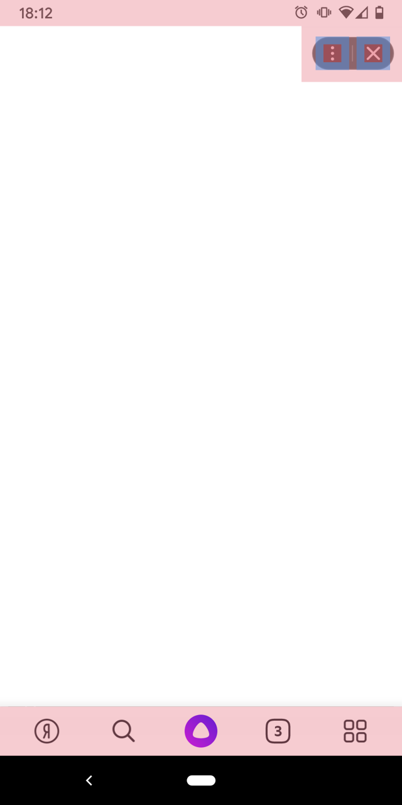
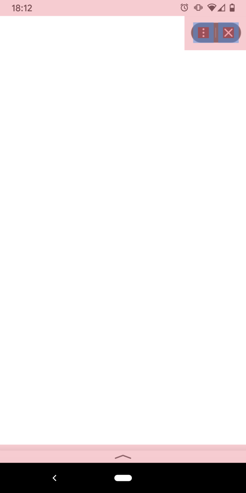

# Интеграция сервиса с Платформой

Миниапп представляет собой оптимизированное веб-приложение, которое имеет доступ к возможностям платформы, умеет работать оффлайн и по ощущениям максимально приближено к работе обычных мобильных приложений.

[Demo](https://yandex.github.io/miniapp-example/)

## Технология реализации миниаппа

Миниапп написан по технологии SPA (Single Page Application) — это веб-приложение, размещенное на одной веб-странице, которая для обеспечения работы загружает весь необходимый код вместе с загрузкой самой страницы. Основное преимущество этой технологии — обновление контента страницы без перезагрузки страницы.

## Гайдлайны по реализации интерфейса
### Панель Платформы

 

На всех экранах Платформы есть нижняя навигационная панель. Это надо учитывать в дизайне миниаппа. При скролле содержимого панель сворачивается. У свернутой панели зона нажатия больше чем сама панель, поэтому не рекомендуется располагать элементы близко к ней.

## Манифест

Манифест — это Web App Manifest с дополнительными секциями для Платформы.

- [Описание полей и примеры](docs/Manifest.md)
- Документация: https://www.w3.org/TR/appmanifest/

Более подробно об [архитектуре](docs/Architecture.md).

## Разработка и запуск
### Команды

- `npm start` - запуск приложения в режиме разработки;
- `npm run build` - сборка production версии приложения;
- `npm run deploy` - развертывание приложения на gh-pages.

### Разработка

- Документация по [React](https://reactjs.org/)
- Документация по [Create React App](https://facebook.github.io/create-react-app/docs/getting-started)
